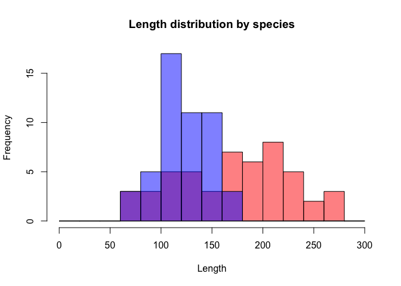
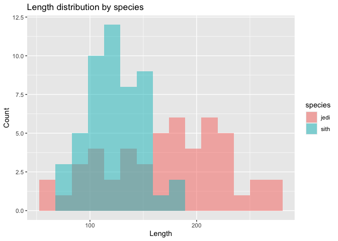
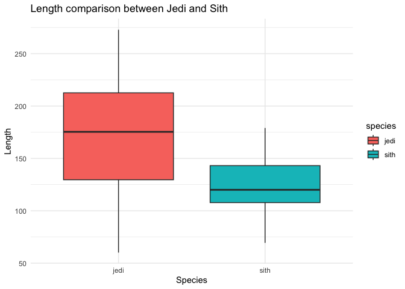
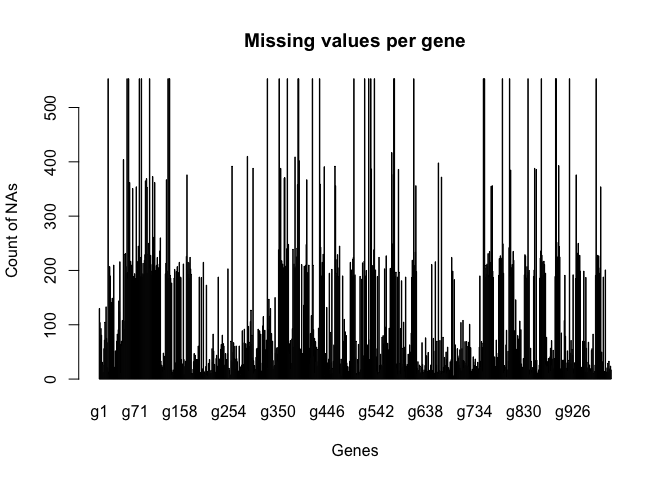
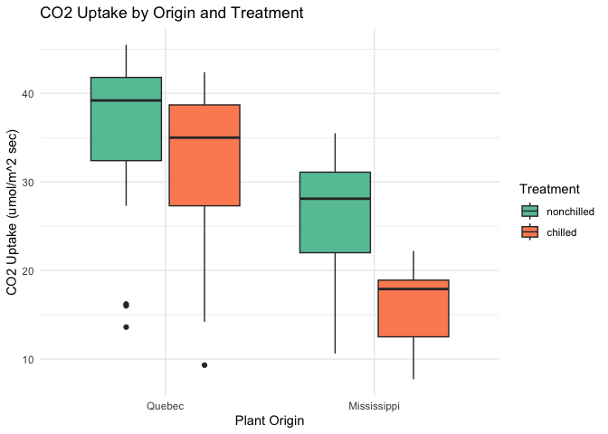
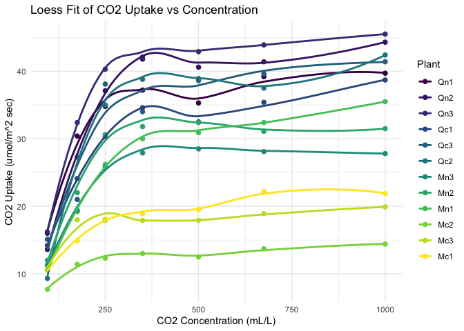

# **1.The ‘magic_guys.csv’ dataset**

**a.** Using the basic ‘hist’ function as well as ‘ggplot’ and
‘geom_histogram’ functions from the ggplot2 package.

**a1.** Using hist function

``` r
library(ggplot2)
data1 <- read.csv("magic_guys.csv", stringsAsFactors = F)

unique(data1$species)
```

    ## [1] "jedi" "sith"

``` r
jedi <- data1$length[data1$species == "jedi"]
sith <- data1$length[data1$species == "sith"]

breaks <- seq(0,300,20)
h1 <- hist(jedi, plot=F, breaks=breaks)
h2 <- hist(sith, plot=F, breaks=breaks)
ymax <- max(h1$counts, h2$counts)

with(data1,hist(length[species == "jedi"],col=rgb(1,0,0,0.5), breaks=breaks, ylim=c(0,ymax),
                main="Length distribution by species", xlab="Length"))
with(data1,hist(length[species == "sith"],col=rgb(0,0,1,0.5), breaks = breaks, add=TRUE))
```



**a2.** Using ggplot and geom_histogram function

``` r
library(ggplot2)

ggplot(data1, aes(x=length, fill=species)) +
  geom_histogram(position="identity", alpha=0.5, bins=15) +
  labs(title="Length distribution by species", x="Length", y="Count")
```



**b-c.** Comparison using box plots. Save plot to pdf, png, and svg.
When to use pdf, png and svg: - pdf: for printing, publications,
submitting to journal - png: for presentation (making PowerPoint
slides), websites - svg: for editing figure in vector graphics software

``` r
p <- ggplot(data1, aes(x = species, y = length, fill = species)) +
  geom_boxplot() +
  labs(title = "Length comparison between Jedi and Sith",
       x = "Species", y = "Length") +
  theme_minimal()
p
```



``` r
# Save to PNG
ggsave("boxplot.png", plot = p, width = 6, height = 4, dpi = 300)

# Save to PDF
ggsave("boxplot.pdf", plot = p, width = 6, height = 4)

# Save to SVG
ggsave("boxplot.svg", plot = p, width = 6, height = 4)
```

# 2. The “microarray_data.tab” dataset.

**a.** How big is the matrix in terms of rows and columns

Number of rows: 553

Number of columns: 1000

**b.** Count the missing values per gene and visualize the result

``` r
data2 <- read.table("microarray_data.tab",sep = "\t", header = T)
dim(data2) 
```

    ## [1]  553 1000

``` r
tab1 <- colSums(is.na(data2))
barplot(tab1, main = "Missing values per gene",
        xlab = "Genes", ylab = "Count of NAs")
```



**c.** Find the genes for which there are more than X% missing values

``` r
find_genes <- function(data2, x) {
  # fraction of missing per column
  missing_fraction <- colSums(is.na(data2)) / 553 * 100
  
  # select genes (column names) above threshold
  genes <- which(missing_fraction > x)
  
  return(list(
    gene_names = colnames(data2)[genes]
  ))
}

find_genes(data2,50)
```

    ## $gene_names
    ##  [1] "g18"  "g48"  "g55"  "g58"  "g60"  "g66"  "g73"  "g79"  "g83"  "g91" 
    ## [11] "g93"  "g94"  "g99"  "g105" "g109" "g132" "g135" "g137" "g138" "g172"
    ## [21] "g260" "g290" "g301" "g329" "g352" "g355" "g362" "g363" "g368" "g383"
    ## [31] "g388" "g389" "g390" "g391" "g406" "g417" "g431" "g432" "g440" "g461"
    ## [41] "g462" "g498" "g519" "g527" "g531" "g532" "g538" "g572" "g575" "g576"
    ## [51] "g577" "g585" "g615" "g619" "g663" "g669" "g751" "g753" "g766" "g768"
    ## [61] "g788" "g802" "g804" "g838" "g851" "g854" "g864" "g892" "g893" "g898"
    ## [71] "g919" "g932" "g971" "g980"

**d.** Replace missing values by the average expression value for the
particular gene.

``` r
# Replace NAs with column means
data3 <- apply(data2, 2, function(col) {
  col[is.na(col)] <- mean(col, na.rm = TRUE)
  return(col)
})

# Keep original column and row names
colnames(data3) <- colnames(data2)
```

# 3. The “CO2” dataset

Visualize the data in CO2 dataset:

From boxplot:

-   Plants from Quebec uptake higher CO2 than plant from Mississippi

-   Consider plants from the same origin, non-chilled plants uptake
    higher CO2 than chilled plants

From dotplot:

-   CO2 uptake increases with ambient CO2 concentration following a
    likely logarithmic fashion.

<u>**a. Grouped box plots**</u>

``` r
help(CO2)
# Plot
# Grouped boxplot
ggplot(CO2, aes(x = Type, y = uptake, fill = Treatment)) +
  geom_boxplot() +
  labs(
    title = "CO2 Uptake by Origin and Treatment",
    x = "Plant Origin",
    y = "CO2 Uptake (umol/m^2 sec)"
  ) +
  theme_minimal() +
  scale_fill_brewer(palette = "Set2")
```



<u>**b. Dot plot**</u>

``` r
# Scatter plot with loess fit per Plant
ggplot(CO2, aes(x = conc, y = uptake, color = Plant)) +
  geom_point(size = 2) +
  geom_smooth(
    method = "loess",
    se = FALSE
  ) +
  labs(
    title = "Loess Fit of CO2 Uptake vs Concentration",
    x = "CO2 Concentration (mL/L)",
    y = "CO2 Uptake (umol/m^2 sec)"
  ) +
  theme_minimal()
```

    ## `geom_smooth()` using formula = 'y ~ x'


