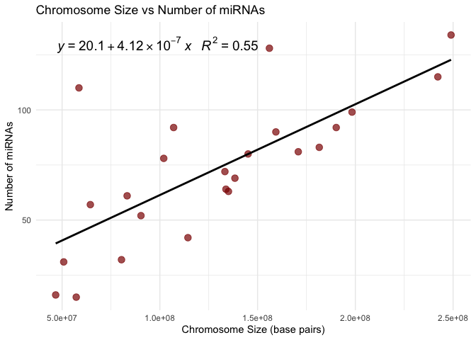

# 1. Install tidybiology

``` r
library(devtools)
devtools::install_github("hirscheylab/tidybiology")
```

# 2. Extract summary statistics

``` r
library(tidybiology)
library(dplyr)

data(chromosome)
summary(chromosome)
```

    ##        id       length_mm       basepairs           variations      
    ##  1      : 1   Min.   :16.00   Min.   : 46709983   Min.   :  211643  
    ##  2      : 1   1st Qu.:27.75   1st Qu.: 82536402   1st Qu.: 4395298  
    ##  3      : 1   Median :45.50   Median :133536366   Median : 6172346  
    ##  4      : 1   Mean   :43.83   Mean   :128677910   Mean   : 6484572  
    ##  5      : 1   3rd Qu.:55.00   3rd Qu.:162210974   3rd Qu.: 8742592  
    ##  6      : 1   Max.   :85.00   Max.   :248956422   Max.   :12945965  
    ##  (Other):18                                                         
    ##  protein_codinggenes  pseudo_genes    totallongnc_rna  totalsmallnc_rna
    ##  Min.   :  71.0      Min.   : 185.0   Min.   :  71.0   Min.   : 30.0   
    ##  1st Qu.: 595.8      1st Qu.: 445.8   1st Qu.: 439.0   1st Qu.:167.0   
    ##  Median : 836.0      Median : 590.5   Median : 633.5   Median :220.5   
    ##  Mean   : 850.0      Mean   : 608.3   Mean   : 613.6   Mean   :208.9   
    ##  3rd Qu.:1055.5      3rd Qu.: 772.5   3rd Qu.: 751.0   3rd Qu.:236.0   
    ##  Max.   :2058.0      Max.   :1220.0   Max.   :1200.0   Max.   :496.0   
    ##                                                                        
    ##      mi_rna           r_rna           sn_rna          sno_rna      
    ##  Min.   : 15.00   Min.   : 5.00   Min.   : 17.00   Min.   :  3.00  
    ##  1st Qu.: 55.75   1st Qu.:13.00   1st Qu.: 49.75   1st Qu.: 36.75  
    ##  Median : 75.00   Median :23.00   Median : 77.00   Median : 59.50  
    ##  Mean   : 73.17   Mean   :22.08   Mean   : 81.00   Mean   : 63.38  
    ##  3rd Qu.: 92.00   3rd Qu.:27.25   3rd Qu.:106.00   3rd Qu.: 76.00  
    ##  Max.   :134.00   Max.   :66.00   Max.   :221.00   Max.   :145.00  
    ##                                                                    
    ##    miscnc_rna     centromereposition_mbp
    ##  Min.   :  8.00   Min.   : 12.50        
    ##  1st Qu.: 66.50   1st Qu.: 18.73        
    ##  Median : 94.50   Median : 38.40        
    ##  Mean   : 92.21   Mean   : 43.36        
    ##  3rd Qu.:107.50   3rd Qu.: 55.25        
    ##  Max.   :192.00   Max.   :125.00        
    ## 

``` r
chromosome %>%
  summarise(
    across(
      .cols = c(variations, protein_codinggenes, mi_rna),
      .fns  = list(
        mean   = mean,
        median = median,
        max    = max
      ),
      .names = "{.col}_{.fn}"
    )
  )
```

    ## # A tibble: 1 × 9
    ##   variations_mean variations_median variations_max protein_codinggenes_mean
    ##             <dbl>             <dbl>          <dbl>                    <dbl>
    ## 1        6484572.           6172346       12945965                     850.
    ## # ℹ 5 more variables: protein_codinggenes_median <dbl>,
    ## #   protein_codinggenes_max <int>, mi_rna_mean <dbl>, mi_rna_median <dbl>,
    ## #   mi_rna_max <int>

# 3. Chromosome size distribution

``` r
library(ggplot2)

# Bar plot of chromosome sizes
ggplot(chromosome, aes(x = factor(id), y = basepairs)) +
  geom_bar(stat = "identity", fill = "steelblue") +
  labs(
    title = "Chromosome Sizes",
    x = "Chromosome ID",
    y = "Size (base pairs)"
  ) +
  theme_minimal() +
  theme(axis.text.x = element_text(angle = 45, hjust = 1))  # rotate x labels for readability
```


# 4. Chromosome size correlation

Linear correlation coefficient:

-   Between chromosome size and number of protein coding genes:
    R<sup>2</sup>=0.37

-   Between chromosome size and number of miRNAs: R<sup>2</sup>=0.55

These values indicate a **moderate, but not very strong, linear
relationship**.

``` r
library(ggpmisc)

# Dotplot 1: Chromosome size vs protein coding genes
p1 <- ggplot(chromosome, aes(x = basepairs, y = protein_codinggenes)) +
  geom_point(color = "steelblue", size = 3, alpha = 0.7) +
  geom_smooth(method = "lm", se = FALSE, color = "black") +
  stat_poly_eq(
    aes(label = paste(..eq.label.., ..rr.label.., sep = "~~~")),
    formula = y ~ x, parse = TRUE, size = 5
  ) +
  labs(
    title = "Chromosome Size vs Number of Protein-Coding Genes",
    x = "Chromosome Size (base pairs)",
    y = "Number of Protein-Coding Genes"
  ) +
  theme_minimal()

# Dotplot 2: Chromosome size vs number of miRNAs
p2 <- ggplot(chromosome, aes(x = basepairs, y = mi_rna)) +
  geom_point(color = "darkred", size = 3, alpha = 0.7) +
  geom_smooth(method = "lm", se = FALSE, color = "black") +
  stat_poly_eq(
    aes(label = paste(..eq.label.., ..rr.label.., sep = "~~~")),
    formula = y ~ x, parse = TRUE, size = 5
  ) +
  labs(
    title = "Chromosome Size vs Number of miRNAs",
    x = "Chromosome Size (base pairs)",
    y = "Number of miRNAs"
  ) +
  theme_minimal()

# Print the plots
p1
```


``` r
p2
```



# 5. The “proteins” dataset

<u>**a. Statistic summary**</u>

``` r
library(tidybiology)
library(dplyr)
data(proteins)
summary(proteins)
```

    ##   uniprot_id         gene_name         gene_name_alt      protein_name      
    ##  Length:20430       Length:20430       Length:20430       Length:20430      
    ##  Class :character   Class :character   Class :character   Class :character  
    ##  Mode  :character   Mode  :character   Mode  :character   Mode  :character  
    ##                                                                             
    ##                                                                             
    ##                                                                             
    ##  protein_name_alt     sequence             length             mass        
    ##  Length:20430       Length:20430       Min.   :    2.0   Min.   :    260  
    ##  Class :character   Class :character   1st Qu.:  251.0   1st Qu.:  27940  
    ##  Mode  :character   Mode  :character   Median :  414.0   Median :  46140  
    ##                                        Mean   :  557.2   Mean   :  62061  
    ##                                        3rd Qu.:  669.0   3rd Qu.:  74755  
    ##                                        Max.   :34350.0   Max.   :3816030

``` r
proteins %>%
  summarise(
    across(
      .cols = c(length, mass),
      .fns  = list(
        mean   = mean,
        median = median,
        max    = max
      ),
      .names = "{.col}_{.fn}"
    )
  )
```

    ## # A tibble: 1 × 6
    ##   length_mean length_median length_max mass_mean mass_median mass_max
    ##         <dbl>         <dbl>      <dbl>     <dbl>       <dbl>    <dbl>
    ## 1        557.           414      34350    62061.      46140.  3816030

<u>**b. Length and mass correlation**</u>

Linear correlation coefficient R<sup>2</sup>=1.00, indicates a strong
linear correlation between protein length and mass.

``` r
library(ggplot2)
library(ggpmisc)

# Dotplot: Protein length vs mass
p <- ggplot(proteins, aes(x = length, y = mass)) +
  geom_point(color = "red4", size = 3, alpha = 0.7) +
  geom_smooth(method = "lm", se = FALSE, color = "black") +
  scale_y_log10() +
  scale_x_log10() +
  stat_poly_eq(
    aes(label = paste(after_stat(eq.label), after_stat(rr.label), sep = "~~~")),
    formula = y ~ x, parse = TRUE, size = 5
  ) +
  labs(
    title = "Protein length vs mass",
    x = "Protein length",
    y = "Protein mass"
  ) +
  theme_minimal()
p
```


